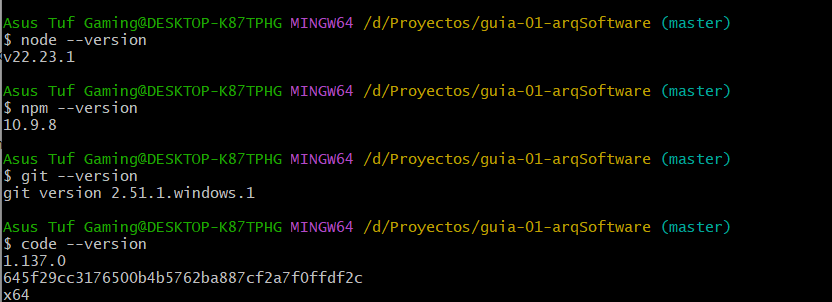
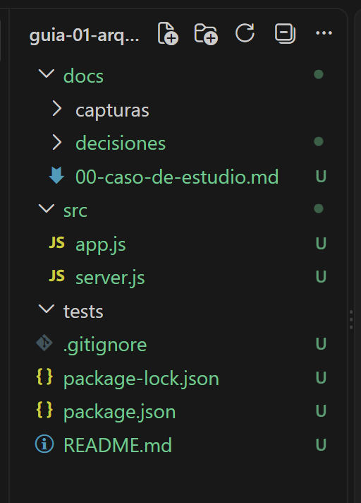
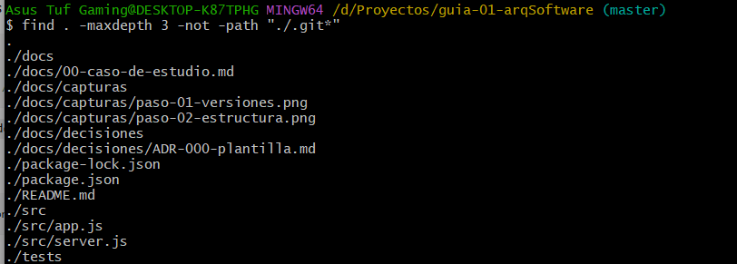

# Guía 01 - Arquitectura de Software

## Datos del estudiante

**Nombre completo:** Williams Rusbelths Quispe Alvitez

## Descripción del curso

El curso de Arquitectura de Software aborda los principios, conceptos y buenas prácticas relacionadas con el diseño y organización de sistemas de software. Se estudian estructuras, componentes, patrones arquitectónicos y herramientas que permiten desarrollar soluciones mantenibles, escalables y correctamente organizadas.

## Expectativas respecto al curso

Mis expectativas respecto al curso son comprender cómo se diseña la arquitectura de un sistema de software, aprender la tecnologias que un sistema pueda requerir para su correcto funcionamiento, lo que mas me interesa o me da curiosidad es que componentes tiene un software para que pueden manejar a mas 15 000 usuarios concurrentes sin que caiga el sistema o tenga alguna falla

## Docente

**Nombre completo:** LIZBETH JAICO QUISPE

---

# Evidencias de la práctica

## Paso 01 - Verificación de versiones

Se verificaron las versiones de Node.js, npm, Git, Visual Studio Code y Docker mediante Git Bash.

## Paso 02 - Creación de la estructura de carpetas

Se creó la estructura inicial de carpetas y archivos correspondiente a la práctica.

### Verificación mediante Git Bash

